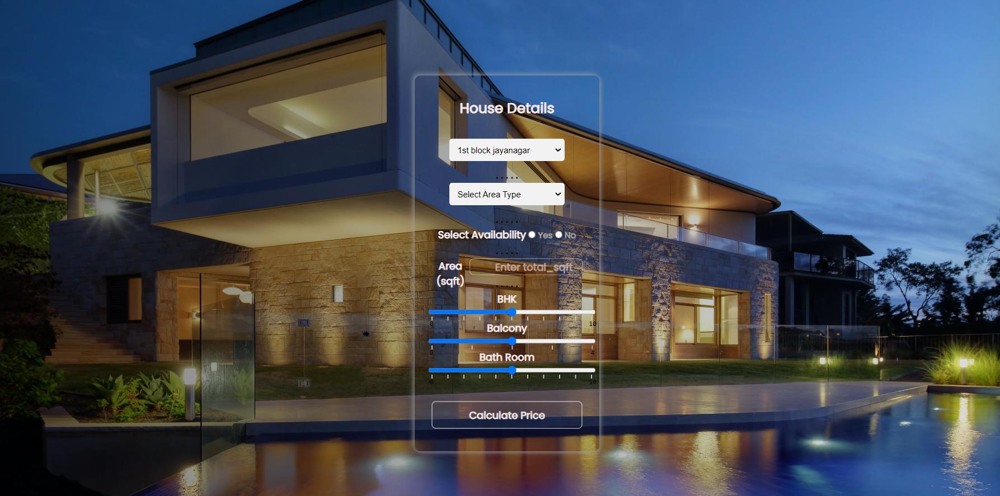

# Bangalore House Price Prediction

Build an end-to-end Machine Learning Project to predict the price of a house in Bengaluru using Linear Regression by identifying factors that have a significant influence on the price like Location, Size, and no. Bedroom/Bathroom/Balcony and availability with an R2 value of 84%.Build an end-to-end Machine Learning Project to predict the price of a house in Bengaluru using Linear Regression by identifying factors that have a significant influence on the price like Location, Size, and no. Bedroom/Bathroom/Balcony and availability with an R2 value of 84%.
Skills: Exploratory Data Analysis · Seaborn · Predictive Analytics · Predictive Modeling · Flask · Amazon Web Services (AWS) · Data Analysis · Python (Programming Language) · Data Structures · Pandas (Software) · Matplotlib · NumPy · Data Science · Machine Learning

Model Building

1. Data collection- Data is taken from Kaggle. Data is unorganized, it has an unknown format, and with unknown data quality issues.
2. Second step is to clean and structure our data where we removed/filled in the missing data. We performed data wrangling like changing the BHK value to an integer, correcting the total sqft value, and converting it to an integer. 
3. Then some feature engineering was done which include converting availability to yes or no and reducing locations by clubbing the location with less count as other locations.
4. Then some exploratory data analysis was done to understand the data/features in great detail.
5. Next step is outlier removal where many outliers were removed based on price per sqft, area per room, bathroom greater than rooms, and 2BHK greater than 3BHK. 
6. Now it's time for preparing the data for the model which include one hot encoding, converting categorical features to numeric, and splitting the data for training and testing.
7. Then hyperparameter tuning was done with k-fold cross-validation and grid search cv to find the best model with the best parameter for our data. 
8. Linear Regression comes out to be the winner and it was used to make a predict price function that can predict the house price by taking all the required features.
9. The model is ready and it is exported as a pickle file to be consumed by our server to predict price.

Model Deployment

The model is deployed on a Python flask server which has two endpoints '/get_location_names' and '/predict_home_price' for getting the location names that will be displayed on the website and for predicting the house price respectively. The flask server consumes a util file that has all the functions for loading the artifacts and performing the desired functions. 

The front end (website) for our model is built in HTML and CSS with a few js to display the location's names in a list on the website. The web page is hosted on an Nginx web server which routes the API calls to the Python flask server to get the estimated price value.

Model Working

The model is deployed on the AWS EC2 instance in which we are allowing all HTTP and HTTPS traffic by opening ports 80 and 443 to all IP addresses ('0.0.0.0'). when we load the public DNS of our EC2 instance it goes to our Nginx server which is serving the HTTP (port 80) and HTTPS (port 443) this Nginx web server is using a reverse proxy setup to divert this HTTP API request to the python flask server which is running on port 5000. The flask server accepts the rest API call and returns the estimated price to the results HTML page.

Tools/Technology Used

1. Python as our programming language 
2. Numpy and Pandas for data cleaning
3. Matplotlib and Seaborn for data visualization
4. Sklearn for model building
5. Jupyter Notebook, visual studio code, and git Bash as IDE
6. Python flask for model server
7. nginx for a web server
8. HTML/CSS/Javascript for UI

Enjoyed doing this project and hope to do many more. 

